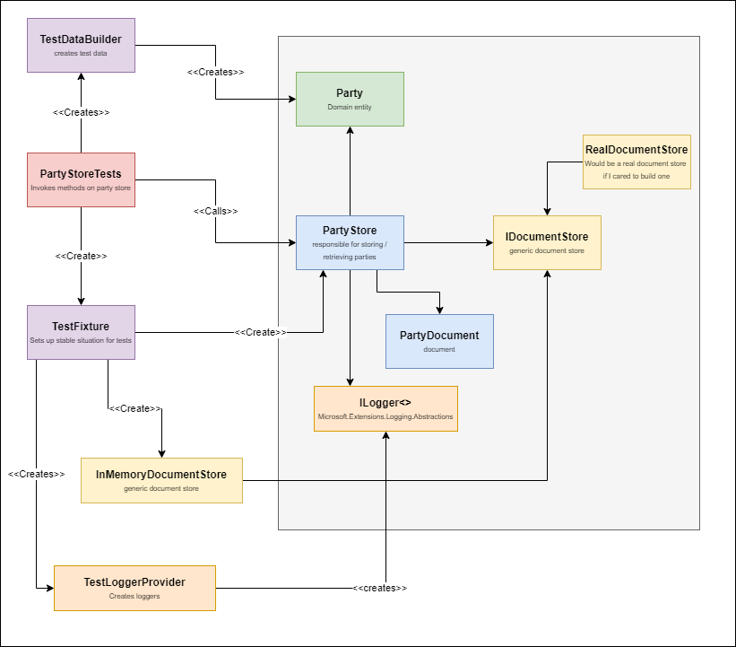

In my previous [post](../well-written-tests), I expressed some characteristics
of well written tests. In this post, i'd like to show some techniques to help
achieve these characteristics. In a future post, I'll try to focus more on
techniques and patterns to avoid. 

# An example test

I'm going to use an extremely simplified example to demonstrate some of the
techniques here. 

Here's the example, including all the classes involved that i'm going to talk
about in the next chapters: 



In this example, we're testing a system to create registrations for a party. 

Have a look [here](https://github.com/Erwinvandervalk/erwinvandervalk.github.io/tree/main/src/good-tests) for
the code accompanying this post. 

> The example is a bit contrived but I found it a challenge to come up with something
> that is both useful to explain the topic, but small enough not to distract from the 
> concepts. So, I'm only including a domain object and a store to save it. No
> http api, command handlers, query handlers, etc. Maybe I'll enrich the example for 
> future posts. 
## Fixtures and test helpers

To test some functionality, there is quite a bit of testing setup
needed. Usually, you have to construct the Subject Under Test, including all of it's
dependencies. Then you have to create some data to use for testing. And then you
have to assert the outcome. So many times do I see the subject under test being
created in the test itself, including some or many of it's dependencies (or, if
you use mocks, set up the mocks in each test). 

Duplicating the construction of your classes in each test case makes maintaining
your tests much harder. When you need to change the dependencies of your test,
all of a sudden you have to modify dozens of tests. Not fun at all!

I very much try to hide things that are not relevant for my tests in helper
methods (if I can only re-use them in a single test) or in a separate fixture
class. I find that this has several big benefits for me:

1. It draws attention in my test only to the important bits. 
2. I build up a library of re-usable functionality, so future tests are much
   easier to write.
3. It reduces the amount of maintenance I have to perform.

Here's an example of the fixture:

``` csharp

public class PartyFixture
{

    private readonly TestLoggerProvider LogProvider;

    public PartyFixture(ITestOutputHelper output)
    {
        LogProvider = new TestLoggerProvider(output);
    }

    public readonly InMemoryDocumentStore InMemoryDocumentStore =
        new InMemoryDocumentStore();

    public PartyStore PartyStore =>
        new PartyStore(documentStore: InMemoryDocumentStore,
                        logger: LogProvider.BuildLogger<PartyStore>());
}
```

The fixture creates instances of all classes needed, including all required
dependencies, such as the PartyStore and the test double InMemoryDocumentStore.
Should the number of dependencies change, you only have a single place to modify
here. 

The test creates the fixture in the constructor. This makes sure we don't have
any shared mutable state. 

## Test data and Test Data Builders

One of the techniques that I find most valuable in unit testing is the use of
Test Data Builders. There are libraries to help you to build test data, such as
AutoFixture, but I tend to create my test data by hand. 

I make a distinction between **Test Data**, which is a collection of re-usable
values that I can use during test data building, and real **Test Data
Builders**, which create new instances of classes for me. The test data builders
create new instances every time called so you can manipulate these instances
where needed. 

The instances created by the test data builder should be valid:
* Most of the time, you need valid data to work with. 
* What is valid data evolves over time, as rules are added / removed. If you
  have to turn invalid data into valid data in every unit test, your tests
  become really brittle. 
* Turning valid data into invalid data usually is simple.

The pattern I'm following in my Tests is that I call the test data **'The'**,
and the test data builder **'Some'**. 

``` csharp

/// <summary>
/// The test data creates new instances of classes to test with. 
/// </summary>
public class TestDataBuilder
{
    public readonly TestData The;

    public TestDataBuilder(TestData the)
    {
        The = the;
    }

    /// <summary>
    /// Create a VALID instance of a party. It's easy to turn
    /// a valid instance in an invalid one but most tests actually work
    /// with valid data. So, start from a VALID instance and work
    /// from there. 
    /// </summary>
    /// <returns></returns>
    public Party.Party Party() => new Party.Party(
        Id: The.PartyId,
        Name: The.PartyName,
        Location: The.Location,
        Date: The.PartyDate,
        Attendees: The.PresentAttendees);
}

```

A couple of rules I'm following for test data builders. 

* Test Data builders create new instances only. You can then safely manipulate
  the instances as needed. 
* Test Data Builders should only create **Test Data**, such as commands,
  queries, events and other types of data holders. Don't create other types of
  classes here, such as loggers, controllers, etc. Use **fixtures** for those. 

``` csharp

public class TestData
{
    public PartyId PartyId = new PartyId(Guid.NewGuid());
    public PartyName PartyName = new PartyName(MyName());
    public Organizer Organizer = new(MyName());

    public Attendee AttendeePresentJohn = new(MyName());
    public Attendee AttendeePresentCatherine = new(MyName());
    public Attendee AttendeeAbsentAlice = new(MyName());
    public Attendee AttendeeAnnoyingAnton = new ( MyName());

    public IReadOnlyCollection<Attendee> PresentAttendees;

    public PartyDate PartyDate => new PartyDate(CurrentDateTime);

    public PartyLocation Location = new PartyLocation(new(MyName()));

    public TestData()
    {
        PresentAttendees = new[] { AttendeePresentJohn, AttendeePresentCatherine};
    }

    /// <summary>
    ///  Always control the current time in your unit
    /// tests. This way, you can easily time travel
    /// </summary>
    public DateTime CurrentDateTime =
        new DateTime(2000, 1, 2, 3, 4, 5);


    /// <summary>
    /// This method is a little trick. It returns the
    /// name of the calling property, but then in snake case
    /// and surrounded by hashtags. This makes it
    /// immediately clear when observing the data that the value
    /// actually IS the expected property, and no more and no less.
    /// </summary>
    /// <param name="attribute"></param>
    /// <returns></returns>
    private static string MyName(
        [CallerMemberName] string attribute = null)
    {
        return $"#{attribute.ToSnakeCase()}#";
    }
}
    
```


* Test Data is mutable. This is an easy way to control what data is created by
  your test data builder. 
* Use the data created by the test data builder and test data in your
  assertions. 

I've found that, while autofixture or Faker can sometimes generate more
realistic test data, it's not realism i'm looking for, it's predictability. So,
for properties where I really don't care what the value is, i'm using a helper
method that uses the name of the property to build a value. IE:
AttendeePresentJohn => #attendee_present_john# 


## With syntax

Within your unit tests, you have the need to control the values that you've just
built. In the party example, I would like to be able to change the name or the
number of attendees. I find the **with** syntax very valuable for this.

``` c#

[Fact]
public void One_person_does_not_make_a_fun_party()
{
    var party = Some.Party()
        with
        {
            Attendees = new[] {The.AttendeePresentJohn}
        };

    party.IsFun().Should().BeFalse();
}

```

This approach has several benefits:
1. It's **immediately clear** what business rule i'm testing here. All the other
   properties (name, location, time, etc..) are completely irrelevant here. The
   only thing you see is the actual business rule. 
2. I don't need to **repeat myself** with all other properties. I've seen soo
   many times that the complete definition of a test data is repeated over and
   over again in each unit test. This makes adding a new property a real
   challenge. 
3. Your test is very **anti-fragile**. If the definition of what **other**
   characteristics that make a fun party ever changes, then this test will keep
   working. 

I sometimes see people create huge test data builders, with specialized
extensions for each property they want to manipulate. The problem of this
approach is that it requires a lot of coding to build this, whereas the language
can just accomodate this .

I hope you can see how this pattern improves maintainability of tests. 

### With syntax before records

Before records came to c#, I used a simple extension method for this. It doesn't
work with immutable data unfortunately but the resulting syntax works just as
well. 

``` c#
public static class ObjectWithExtensions
{
    public static T With<T>(this T subject, Action<T> doAction)
    {
        doAction(subject);
        return subject;
    }
}

var party = Some.Party()
    .With(x => x.Name = new PartyName("different"));


```

## Assert big, not small

When it comes to asserting things in tests, I often see people writing long lines of assertions, 
where each property is asserted separately. 

I very much recommend against this. While it seems very precise, the problem comes when you are 
maintaining your software. Adding a property will NOT break your tests, so developers often 
forget to add the property. You now have a blind spot in your test, which makes your tests
less likely to catch issues. 

When you have to change the definition of your class, you now also have to modify several tests, 
because each test has assertions for each property. If you have to change many tests to do a change, 
you are also undermining the reliability of your tests. 


My recommendation is usually:

1. Either be very focussed on your assertions
2. OR assert against a known OK object (which is then created by a test data builder)

Now this is not always possible or practical (for example, when you have non-deterministically generated
values in your code) but it's a good thing to strive for. 

Here's a (little contrived) example:

``` csharp
    [Fact]
    public async Task Can_save_new_party()
    {
        var party = Some.Party();
        await PartyStore.Save(party);

        var saved = await PartyStore.Get(The.PartyId);

        saved.Should().BeEquivalentTo(party);
    }
```

I'm not asserting that the individual property values are valid. Instead, I'm asserting against 
an expected result object. In this case, it's really simple, because the shape is the same between 
the input / output. 

When the shape is not the same, this is where a the **Test Data** from the previous paragraph shines. 

Two objects, created by different methods on the Test Data Builder will generate the same 'logical'
output value. 

### non-deterministic values
Handling non-deterministically generated values is a bit of a challenge. Some assertion frameworks (such 
as fluent assertions or Verify) have methods to compensate for this. 

Another approach is to see if you can design your software to make the generation of your data 
deterministically, either by using a deterministic data generator in the actual code, or by injecting
deterministic generation for your tests only. 

Controlling Datetime.Now in your tests is also a really important aspect (I'll go more into that topic in a future blogpost)
but if you control what **now** means to your code, it makes the output of your tests soo much more deterministic.


## Logging in unit tests. 

The last thing I'd like to address is logging in unit tests. 

> In .Net, the default way how you add logging is to add ILogger<T> as a
dependency in most of our classes. This approach has pro's and cons, which i'm
not going to go into in this post. This does mean, that every class that wants
to do logging, now requires an ILogger as dependency. 

The way people mostly analyze problems in production is by adding logging to
their system. Debugging in production is often not possible, so the logs are the
only way you can analyze a problem. 

If logs are very important to analyze a problem in production, why not use them
to analyze problems in your unit tests? I often see people inject a NullLogger
into their classes when testing. This is such a wasted opportunity. By writing
the log output to a console (or in my case, the ITestOutputHelper from XUnit), I
get a detailed log for everything that happened in my tests. 

> One of the least fun things is when you have a test that succeeds locally, but
> fails on the build server. Having detailed log output from your test can mean
> all the difference. 

To get log output in my unit tests, I typically use a
[TestLoggerProvider](https://gist.github.com/Erwinvandervalk/89fda5ba57f10ac3a5d22f26a5c42ca8),
which simply pipes log output to XUnit ITestOutputHelper. Then I add a couple of
tricks, such as, change the output format to be more helpful for me, such as
printing the elapsed time, not the date time (which is not very valuable) or
pretty printing exceptions with all properties. 

The benefit of using XUnit ITestOutputHelper is that all output is correlated to
a test. If you simply write using Console.Write and or a Static Logger, then
your test output is not correlated with a specific test. 


# Conclusion

I've given several patterns that I'm using over and over again in my unit tests.
I've found these practices to greatly improve the maintainability of my tests
and improve the speed at which I can develop software. So I hope they help you
as well. 


