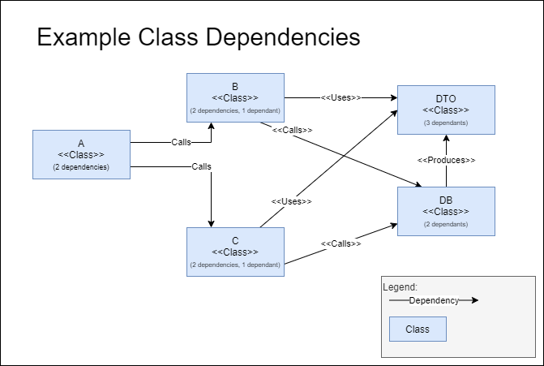

In this post, I'll do my best to move you away from mocking libraries and the tendency of some .Net developers to declare interfaces on EVERY class. 

## TLDR;

Don't rely on Mocking libraries. Reliance on mocking libraries causes:
* increased coupling between classes.
* reduced readability of your tests. 
* reduced maintainability of your application.

Don't blindly declare interfaces on every class. Introduce abstractions when you need them, not as a reflex. 

Do:
* Design your classes and components so that truely external dependencies can be isolated.
* When needed, write hand crafted test doubles to simulate dependencies like external services.

As a test: Can you refactor your code without having to make changes to your tests?

So, stop making a Mock<things> and you'll be better off. 


## Background: I see mocking everywhere


Part of my job is reviewing code written by other teams. As a (primarily) .Net
developer, that means reading a lot of c# code. It's clear that many developers
have become familiar with Test Driven Development, which is of course a good
development.  However, I'm finding that the .Net Community uses Mocking a lot,
using libraries like [FakeItEasy](https://fakeiteasy.github.io/),
[Moq](https://github.com/moq/moq), [NSubstitute](https://nsubstitute.github.io/)
or one of the many other frameworks. 

What I typically see is:
* The Single Responsibility principle is followed, so there are a lot of smaller
  classes.
* Most classes have interfaces (dto's the obvious exception), but there's only a
  single implementation in the codebase. 
* Each is wrapped in it's own unit test. 

These developers clearly think they are getting a lot of benefits from writing 
tests so they use their good intentions to spend a lot of energy to write tests 
that don't nearly provide them as much benefits as they would have hoped. 

When I challenge this mocking approach, I get a lot of push-back: *"A unit has to be
a class"*. *"If you don't isolate the class, you're testing things double"*. *"This is the 
only way"*. *"You must isolate a class, otherwise you're doing integration testing"*.

The thing is, it wasn't always like this. This post from [Martin Fowler](https://martinfowler.com/articles/mocksArentStubs.html) 
describes that classical TDD didn't used to rely on mocking. 

>The classical TDD style is to use real objects if possible and a double if it's
>awkward to use the real thing. So a classical TDDer would use a real warehouse
>and a double for the mail service. The kind of double doesn't really matter
>that much.

>A mockist TDD practitioner, however, will always use a mock for any object with
>interesting behavior. In this case for both the warehouse and the mail service

Somewhere down the line, the practice of testing *units* in isolation, was
translated to testing *classes* in isolation and mocking the rest, facilitated
by mocking frameworks. I'll do my best to describe the problems I'm seeing with
this 'mockist' approach to testing and show alternatives to them. 

## What are mocks, stubs and fakes

There's a difference between mocks, stubs and fakes. I really like the definitions from [Martin Fowler](https://martinfowler.com/articles/mocksArentStubs.html) article again:

> * Dummy objects are passed around but never actually used. Usually they are just used to fill parameter lists.
* Fake objects actually have working implementations, but usually take some shortcut which makes them not suitable for production (an in memory database is a good example).
* Stubs provide canned answers to calls made during the test, usually not responding at all to anything outside what's programmed in for the test.
* Spies are stubs that also record some information based on how they were called. One form of this might be an email service that records how many messages it was sent.
* Mocks are what we are talking about here: objects pre-programmed with expectations which form a specification of the calls they are expected to receive.

From a high level, they all perform the same task: replacing real functionality with a substition so you have control over the substitution. Most mocking libraries, such as NSubstitute can handle all of these types. 

# The problems with excessive mocking & mocking libraries

My biggest problems with the usage of mocking libraries are:

1. You're increasing coupling, which limits your ability to refactor.
2. You're testing the internals of your class, limiting your possibilities to refactor.
3. A mock has to simulate the behavior of your class, so you have to implement some logic twice. 

I'll go into these points more below. 

## Decreased maintainability due to Increased coupling 

Using mocking libraries dramatically increases the number of dependencies a class has. Consider the following diagram. 

. 

It's a fairly straightforward set of classes. Class **A** depends on Class **B**
and **C**, which in their turn depend on Class **DB** and class **DTO**.
Intentionally, there is no functional description to these classes, but you
could think of class A being a controller, Class B and C providing some form of
business logic and Class **DB** providing Database Access and Class **DTO**
being a data transfer object. 

The number of dependencies is fairly low. This makes refactoring a lot easier.
Consider:
1. A change to class **DB**. It will likely impact class **B** and **C**. 
2. A refactoring where parts the logic of **B** and **C** can be re-used and
   will be factored in a separate class. This impacts **B** and **C** and likely
   also **A**. 

The obvious consequence of this approach is, that, if you change the *signature*
of your class, you'll also have to change all classes that use the signature. 

THe non-obvious consequence of this approach, is that in order to create good
mocks, you'll also need to know a little bit about the runtime behavior of the
classes being mocked. Not everything can be read from the signature. What data
is being returned? In which order? What kind of validation rules are being
performed by the class calling your method? 

So, if you don't rely on mocks, you end up with a much decreased maintenance burden. 

## Refuctoring (having to change your tests when you refactor your solution)

When relying on mocks, you have to create a good test double for the actual logic. This means
that your test has to actually have to know deeply about the internal logic of your class. Any
change to the internals of your class means a change to your tests. This is known as a 'refuctor' 
(a term coined by Greg Young as far as I know). 

Your test is your safety net while doing changes. Making changes to your safety net when you need to
rely on it is not a very good idea. 

So how do we prevent that? Don't mock your implementation, but *where possible* rely on the real implementation (more on that below.)

## Hard to understand test tests. 

The arrange-act-assert pattern of tests is often used in conjunction with mocking and SRP. So badly, that I often
see people adding comments to show which bit of the test actually is part of arranging / acting / asserting. Shouldn't 
that be clear from the actual code, rather than the tests?


In the arrange step, you set up your mocks. Often, specific tests have specialized setup requirements. So, each mock setup is every so slightly different. But, because you have
to mock out every interaction, it's not clear if a specific interaction is there 'just because(tm)' or if it's actually significant for your tests. 

Then you have an act phase. This is usually the best part of your tests. The thing that's really important. But it's buried in the rest of your test. So you have to put a ``` csharp //act ``` comment above it
just to call out that it's a 

Then there is the assert. Sometimes you see big lists of assertions, but also often a Mock.Verify(). When you first read this test, 
you have NO idea what's actually being verified. Then you have to look back

What's a better approach to this? The Given-When-Then pattern usually makes much more readable tests. 
Given a certain state, when you perform an action, you observe the following results. 

This focusses much more on the functionality (What the system is supposed to do), rather than on the implementation details (How the system is actually performing it). 

To compare and contrast, I've created two solutions in the same repo:

[https://github.com/Erwinvandervalk/Examples.Testing.Corona](https://github.com/Erwinvandervalk/Examples.Testing.Corona)

One application is written using mocking, the other is not.

Compare the following test that uses mocking with the one below without:

``` csharp
        [Fact]
        public async void When_confirming_existing_appointment_then_returns_success_response()
        {
            // Arrange
            var repository = A.Fake<ICoronaTestRepository>();
            var dateTimeProvider = A.Fake<IDateTimeProvider>();

            A.CallTo(() => repository.Get(An<Guid>.Ignored, CancellationToken.None))
                .Returns(Task.FromResult<CoronaTestEntity>(new CoronaTestEntity()
                {
                    Id = Guid.NewGuid(),
                    Location = "a location",
                    Status = TestStatus.Scheduled,
                    TestSubjectIdentificatieNummer = "number",
                    TestSubjectName = "name",
                    Version = 1
                }));

            var sut = new RecordTestAdministeredCommandHandler(repository, dateTimeProvider);

            // Act
            var result = await sut.Handle(new RecordTestAdministeredCommand()
            {
                Id = Guid.NewGuid(),
                AdministeredOn = DateTimeOffset.Now
            }, CancellationToken.None);

            var success = result.ShouldBeOfType<SuccessResponse>();
            success.Version.ShouldBe(2);
            success.Id.ShouldNotBe(Guid.Empty);
        }
```
In this test, I have to set up the mocks. A lot of things 


``` csharp

        [Fact]
        public async Task Can_schedule_appointment()
        {
            var request = Some.ScheduleTestRequest(); 
            var expectedResponse = Some.GetScheduledTestResponse();

            await CoronaTestClient.ScheduleTest(
                request: request,
                expectedStatusCode: HttpStatusCode.OK);

            var (response, result) = await CoronaTestClient.GetTest(The.TestId);

            result.ShouldBeEquivalentTo(expectedResponse);
        }

```

This test works at the api boundary (though it would have worked equally well at the command / query layer). 


## Single Responsibility Principle causes harm here

Bob martin coined the SOLID Principles, with the Single Responsibility Principle being the one people
remember the best. 

This leads you to create small classes, each with their own little responsibility. This means we're breaking
up the functional problem we're trying to solve and splitting it into smaller classes. While there is something
to be said for this *(but please people, within reason, don't push it to the extreme)*, it has some serious 
drawbacks when you combine it with writing tests PER Class:

Your business logic is spread across multiple classes, so the tests that verify them are also scattered. 

For example:
1. Input validation (IE: is a field of the right type?) is usually done where you map the request to your model. For example in the controllers. 
2. Busines rule validation is often done in a domain layer
3. With the exception of validation rules that are easier / better to do in the database. For example, duplicate constraints can very easily be handled in the database in a transactional fashion. Trying to do this in the business layer means you're going to have 
4. Some validations cannot (or shouldn't) be done transactionally, but are actually part of an asynchronous business process. 

In an ideal world, you can look at the tests to get a good understanding of the functionality and rules of the system. When each test only covers a single class, and each class only covers a small part of the functionality, it becomes really hard to get a good overview of the system. 

I often hear, yes, but if you test more than one class, you're writing integration tests. 

## Compare and contrast


# Alternatives 


## Not every class is created equally

## Focussing on flow 

